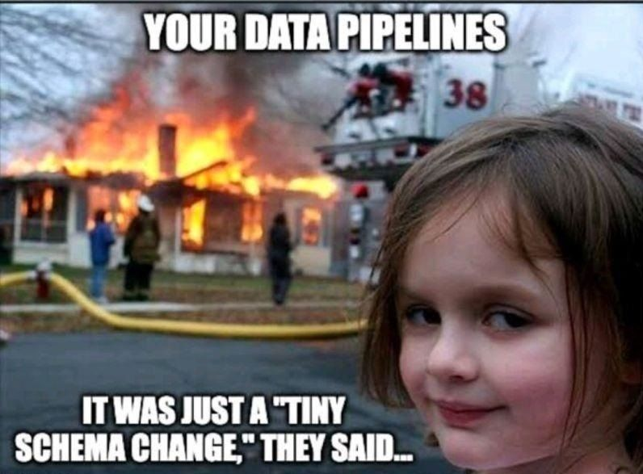
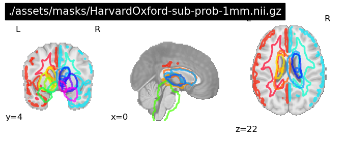
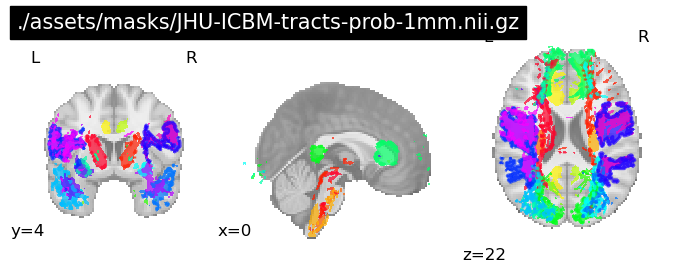
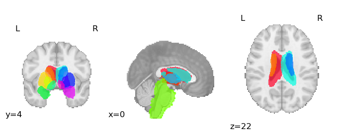
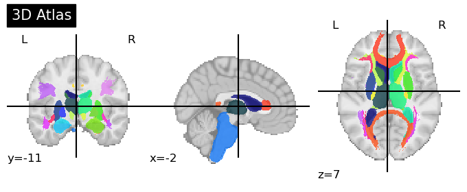

# Neuroimager

The intetion of this pacakge is to make the crossplatform coding and computing much easier. 
I am using Linux and the remote HPC systems together and sometimes I may use windows or colab.
It's not very pleasent to keep things synced. Plus different system may have compatibility issues. 
Build a package can keep the analysis scripts short and concise.

This package provides some utilities used for MRI data analysis. And some of them also supports SKLearn Pipeline.
Note this package is mainly warppers of other packages, intended to optimize for neuroimaging analysis 
(That's why I can this warppers locally). The tools, especially the pipelines are build based on my personal projects,
so it may not be very general and suits your need. But I will try to make it more general if I am able to do.



# A Highly Warpped Pipeline for Task-fMRI analysis
This is built on top of nilearn pipeline, doing 1st level and 3rd level analysis as defined by FSL.
Only a few parameters needs to be set, and the pipeline will do the rest. See example scripts for more details.
```python
task_pipe = Pipeline(
    [
        (
            "first_level",
            FirstLevelPipe(
                tr=TR,
                contrasts=first_contrasts,
                out_dir=first_out,
                prep_func=proc_img,
                first_level_kwargs=first_level_kwargs,
            ),
        ),
        (
            "higher_level",
            HigherLevelPipe(
                tr=TR,
                design_matrix=higher_design,
                contrasts=higher_contrasts,
                non_parametric=non_parametric,
                out_dir=higher_out,
                higher_level_kwargs=second_level_kwargs,
            ),
        ),
    ]
)

results = task_pipe.fit(
    (all_img, confounds, confounds_items, events),
)
```

# Automatic Analysis of HMM model estimated by HMM-MAR
## Get all model selection metrics and generate a HTML report

```python
from neuroimager.pipes.hmm import HmmModelSelector

selector = HmmModelSelector(
    models_dir=models_dir,
    krange=krange,
    rep_num=rep_num,
    volumes=volumes,
    subj_num=sub_num,
    sessions=session_num,
)
selector.auto_parse()
```

## Get the features of the selected models

```python
from neuroimager.pipes.hmm import HmmParser

hmm = HmmParser(
    hmm_file,
    volumes=volumes,
    subj_num=sub_num,
    sessions=session_num,
    output_dir=output_dir,
    roi_labels=roi_labels,
    auto_parse=True,
    generate_report=False,
)
hmm.generate_report(threshold=0.15, plot_vpath=True)
print(hmm.chronnectome)
```

# Atlas Operation

Suggest you have two probability atlas:

```python
from nilearn import plotting
import nibabel as nib
import os

# Plot the original prob masks
atlas_path = "./assets/masks/"
files = [
    "HarvardOxford-sub-prob-1mm.nii.gz",
    "JHU-ICBM-tracts-prob-1mm.nii.gz",
]
atlas_paths = [os.path.join(atlas_path, file) for file in files]
# plot listed atlases with nilearn.plotting.plot_prob_atlas
for file in atlas_paths:
    img = nib.load(file)
    plotting.plot_prob_atlas(img, title=file, draw_cross=False, threshold="auto")
    plotting.show()
```

 


Then you can use the atlas_operation to do some operations on the atlases:

## Remove selected regions
```python
from neuroimager.utils import filter_rois
from nilearn import plotting
import nibabel as nib
harvard_sub = nib.load("./assets/masks/HarvardOxford-sub-prob-1mm.nii.gz")
rois_to_remove = [0, 1, 11, 12]  # remove the cortical regions in this atlas
output_path = "./assets/output/filtered_harvard_sub.nii.gz"
filtered_atlas = filter_rois(harvard_sub, rois_to_remove, output_path)
plotting.plot_prob_atlas(filtered_atlas, draw_cross=False, threshold="auto")
plotting.show()
```



## Merge two atlases

```python
from neuroimager.utils import combine_probabilistic_atlases

atlas_paths = [
    "./assets/output/filtered_harvard_sub.nii.gz",
    "./assets/masks/JHU-ICBM-tracts-prob-1mm.nii.gz",
]
combined_atlas = combine_probabilistic_atlases(
    atlas_paths, "./assets/output/combined_prob_atlas.nii.gz"
)
plotting.plot_roi(combined_atlas, title="3D Atlas")
plotting.show()

```
